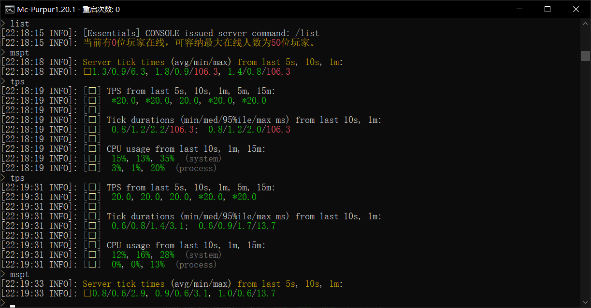
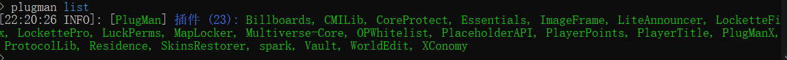

<p align="center">
  <a href="https://purpurmc.org/">
    
  </a>
</p>


服务器核心的选择会对性能和API接口的可用性造成很大影响。目前有很多种主流的服务器核心，但也有一些核心出于各种原因应该避免使用。

推荐:

- [Paper](https://github.com/PaperMC/Paper) - 最常用的服务器核心，旨在提高性能，同时修复游戏和机制不一致的问题。
- [Pufferfish](https://github.com/pufferfish-gg/Pufferfish) - Paper 分支，进一步提高服务器性能。
- [Purpur](https://github.com/PurpurMC/Purpur) - Pufferfish 分支， 旨在提高服务器性能和高度自定义配置。**[极力推荐]**

> 本端使用的是Purpur-1.20.1-2062.jar,开服脚本简简单单编写一下即可,如下:

```bat
java -Xms4096M -Xmx4096M -XX:+UseG1GC -XX:+UseCompressedOops -jar Purpur-1.20.1-2062.jar nogui
```

或者使用我所简单编写的脚本:
具有 **自动重启,自定义标题,方便更改核心**的基本内容:

```bat
@ECHO OFF
setlocal

:: 设置内存和 JAR 文件名
set MIN_RAM=4G
set MAX_RAM=4G
set SERVER_JAR=Purpur-1.20.1-2062.jar

:: 设置重启延迟时间（秒）
set RESTART_DELAY=3

:: 自定义标题
set TITLE=Mc-Purpur1.20.1

:: 初始化重启计数器
set RESTART_COUNT=0

:: 显示启动信息
echo ------------------------------------------------------------------
echo --                                                              --
echo --                           正在启动                           --
echo --                                                              --
echo ------------------------------------------------------------------

:restart
:: 设置窗口标题，包括重启次数
title %TITLE% - 重启次数: %RESTART_COUNT%

:: 启动服务器
java -Xms%MIN_RAM% -Xmx%MAX_RAM% -XX:+UseG1GC -XX:+UseCompressedOops -jar %SERVER_JAR% nogui

:: 增加重启计数器
set /A RESTART_COUNT=%RESTART_COUNT% + 1

:: 检测服务器崩溃
echo ------------------------------------------------------------------
echo --                                                              --
echo --                  服务器崩溃或停止，正在重启中...              --
echo --                                                              --
echo ------------------------------------------------------------------

:: 动态显示重启倒计时
set /A COUNT=%RESTART_DELAY%
:countdown
cls
:: 设置窗口标题，显示倒计时和重启次数
title %TITLE% - 重启次数: %RESTART_COUNT% - 服务器将在 %COUNT% 秒后重启

echo ------------------------------------------------------------------
echo --                                                              --
echo --                  服务器将在 %COUNT% 秒后重启                  --
echo --                                                              --
echo ------------------------------------------------------------------
timeout /T 1 /NOBREAK >nul
set /A COUNT=%COUNT% - 1
if %COUNT% GEQ 0 goto countdown

:: 倒计时结束后重启服务器
goto restart
```

成功开启 后基本是这样的了,后续添加插件界面不唯一:


无报错即为成功开启,可测试

当前添加的插件有:


> 也都是最基本的插件

前往插件列表查看详细的插件介绍及下载地址: [插件列表](./插件列表) `长期更新`